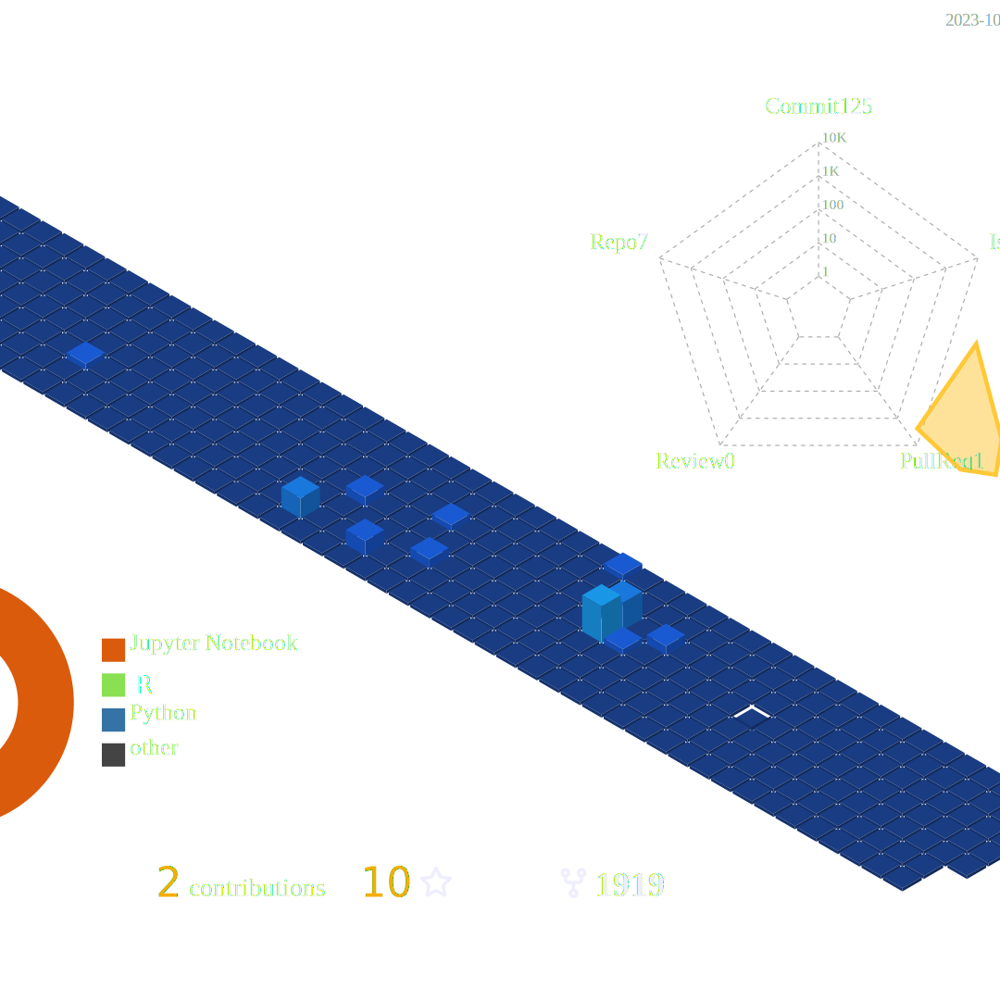

# Hey there! 👋 I'm Nasif Safwan  

 

## 🚀 About Me:
I’m a **Machine Learning Enthusiast** with a passion for solving real-world problems through data, technology, and innovation! I love exploring cutting-edge AI technologies and contributing to open-source projects. 

- 🔭 I’m currently working on: **Medical Imaging**
- 🌱 I’m currently learning: **Deep Learning**, **Generative AI**, **Data Engineering**
- 🤝 I’m looking to collaborate on: **Open-source AI/ML projects**, **Hackathons**
- 🤖 Ask me about: **Data Science**, **AI/ML**, **Python**, **TensorFlow**
- 📫 How to reach me: **nasifsafwan@gmail.com**
- ⚡ Fun fact: **I’m also a huge fan of Football ⚽️ and enjoy playing!**

 

## 💼 Skills and Tools:

    
    
    
    
    
    
    
    
    
    
    
    

 

## 🏆 GitHub Stats:
<!-- v -->
<!-- Profile summary -->
<!--<h2>Profile summary</h2>

 <picture align="left">
    <source srcset="https://github-readme-stats.vercel.app/api?username=nasifsafwan&show_icons=true&hide_border=true" media="(prefers-color-scheme: light)" width="49%" />
    
  </picture>

  <picture align="left"> 
    <source srcset="https://streak-stats.demolab.com/?user=nasifsafwan&hide_border=true" media="(prefers-color-scheme: light)" width="47%" />
    
  </picture>

  <picture align="right">
    <source media="(prefers-color-scheme: light)" srcset="images/Mediamodifier-Design.svg" width="98%">
    
  </picture>
-->

    
    

 

## 🌍 Languages I Use:

    

 

## 🎨 Dynamic Section (Optional):

  
✨ Recent Projects:

  <ul>
    <li><b>Project 1</b>: T3SSLNet: Tri-Method Self-Supervised Learning Based Pre-trained Network for MRI Brain Tumor Classification [[GitHub Repo](https://github.com/nasifsafwan/T3SSLNet)](#)</li>
    <li><b>Project 2</b>: My Various Projects on Data Science and EDA [[GitHub Repo](https://github.com/nasifsafwan/Data-Enthusiasm)](#)</li>
    <li><b>Project 3</b>: ExtremoInsight. A project on detecting extremism. [[GitHub Repo](https://github.com/nasifsafwan/ExtremoInsight)](#)</li>
  </ul>

  
📖 Blog Posts:

  <ul>
    <li><b>Post 1</b>: Title of blog post. [Read More](#)</li>
    <li><b>Post 2</b>: Title of blog post. [Read More](#)</li>
    <li><b>Post 3</b>: Title of blog post. [Read More](#)</li>
  </ul>

 

## 📫 Connect with Me:

    
    
    

---

    

